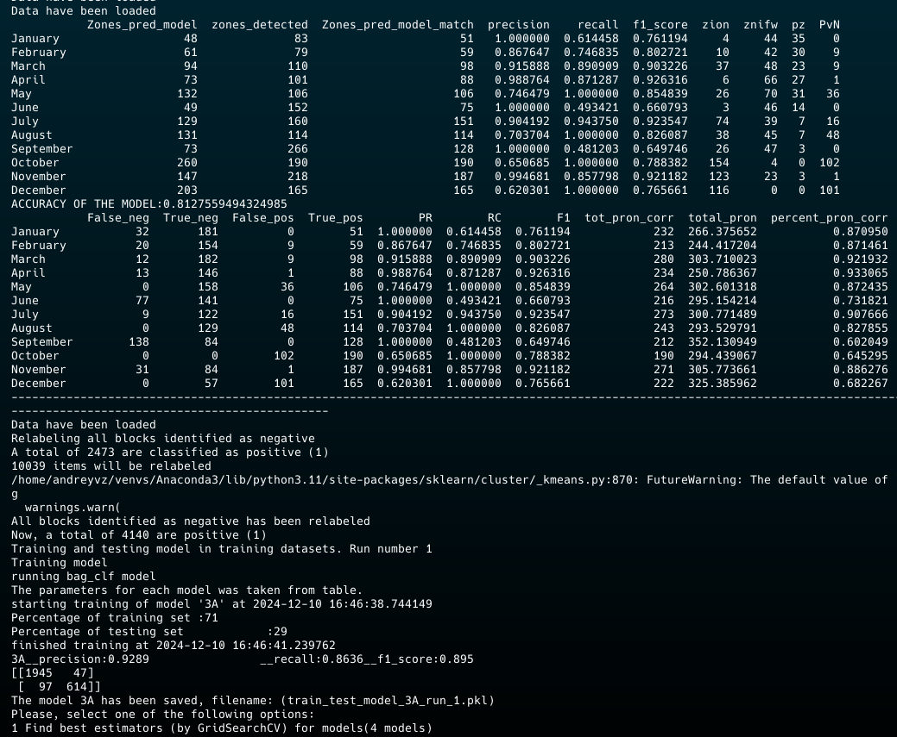

Project to build machine learning models based on random forest for a scientific paper 

**Scientific paper**: *"An Application of the Random Forest Algorithm to Predict Dengue Incidence Using Geographic and Entomological Data Data"*

**Submitted** **to**: Computer Biology and Medicine

### Authors

    Andrey Vinajera-Zamora
    Samuel Montejo-Sánchez
    Jorge Vergara-Quezada
    Juan Castillo-Garit

### Instructions

    1. Install the Anaconda python
    2. Activate environment and then navigate until the project folder
    3. Run the file @toolbox.py
   
        python3 @toolbox.py

The time for learning and testing of the model will depend of computer's specifications.

After select the option to train the model the following orientation will appear.

after select the model with the datasets, you must to select if you want to test the model during the training (is recommended).

The full output of console is like the following picture.

**NOTE**: All estimators for each model were found previously.